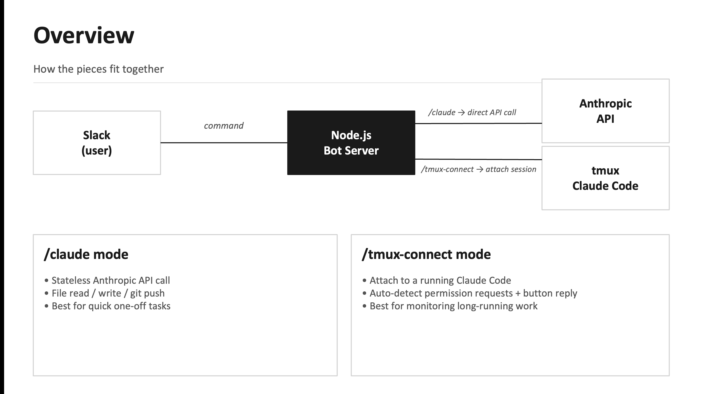

# claude-slack

Using a personal Slack workspace and a custom Slack bot to (1) control a Claude Code agent running in a server's tmux session, and (2) make direct Anthropic API calls to the Claude model — independent of the tmux session — for one-off tasks and questions.

